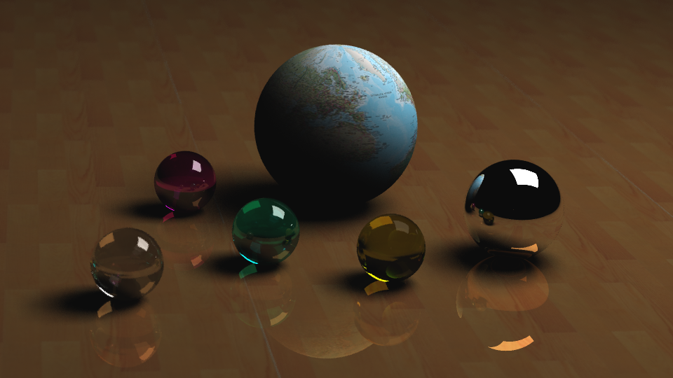
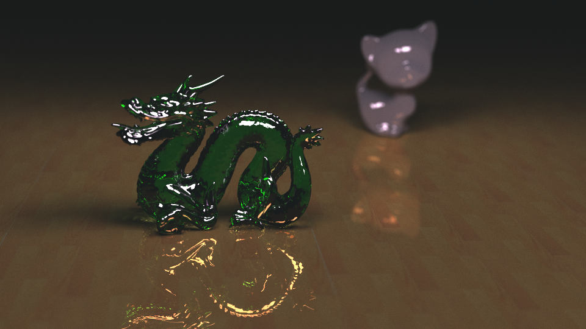
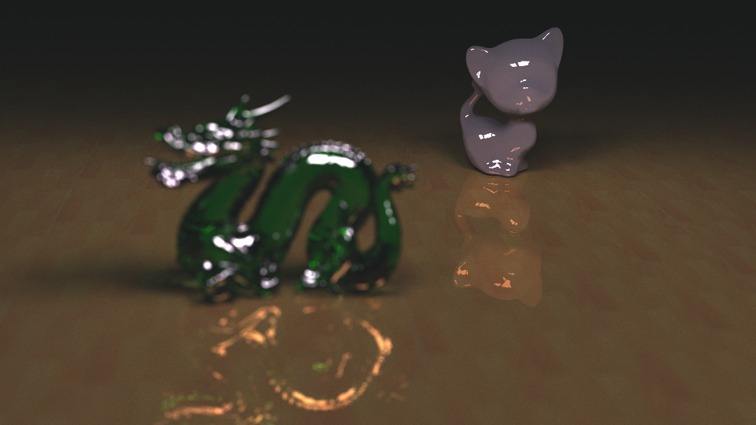

# Ray-tracer

Computer Graphics Course Project: Image rendering with Ray Tracing.

# How to run
1. Compile with Makefile
2. Run with following arguments:
```
./main [-n <round>] [-d <x> <y>] [-p] [-na]
    [-i <input>] [-c <input>] [-o <output>] [-b <output>] 

-n specifies the number of iterations.
-d uses debug mode, which only renders one pixel specified by <x> <y>.
-p uses preview mode, which only renders the outline of objects.
-na uses naive ray tracing. Without this argument, path tracing (also called Monte-Carlo ray tracing) is used.
-i specifies input file (in xml format, see files in 'input/' for example).
-c means continue rendering based on the given image (must be text format).
-o output as text format at the given location.
-b output as bmp format at the given location.
```

# Supported features
* [Path Tracing](https://en.wikipedia.org/wiki/Path_tracing)
* Different fields of view (see example below)
* Texture Mapping
* [Fast Triangle Intersection Check with KD-Tree](http://www.flipcode.com/archives/Raytracing_Topics_Techniques-Part_7_Kd-Trees_and_More_Speed.shtml)
* Soft Shadows
* Vertex Normal Interpolation
* Multi-threaded Rendering

# Rendered Examples

Using inputs/balls.xml:


Using inputs/dk.xml (focus on dragon):


Using inputs/dk.xml (focus on kitten):

